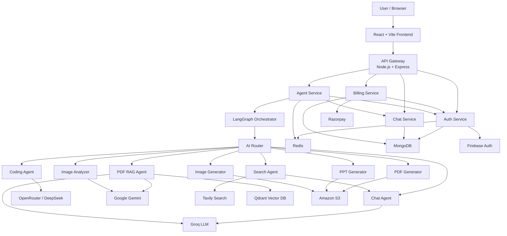

# 🤖 VisionAI

### Production-Style Multi-Agent AI Workspace with LangGraph, RAG, Web Search, Code Generation, Document Generation & Multimodal AI

VisionAI is a full-stack **multi-agent Generative AI platform** that intelligently routes user requests to specialized AI agents for general conversation, coding, real-time web search, PDF question answering, document generation, presentation generation, image generation, and image understanding.

The platform combines a **React frontend**, **Node.js/Express microservices**, **LangChain + LangGraph orchestration**, **Qdrant vector search**, **Redis memory**, **MongoDB persistence**, multiple LLM providers, Firebase authentication, Razorpay billing, and an AWS-based deployment architecture.

The system is designed as more than a chatbot: each request can be dynamically classified, routed, enriched with external context or uploaded documents, processed by a specialized agent, persisted as conversation history, and returned as text, images, downloadable files, or interactive code artifacts.

---

## ✨ Key Features

* 🧠 **LangGraph-powered multi-agent orchestration**
* 🔀 Automatic request routing based on user intent
* 💬 Conversational AI with persistent conversation history
* 🌐 Real-time web search using Tavily
* 💻 AI coding agent for generation, debugging, review and optimization
* 🖥️ Interactive Monaco-based code artifact viewer
* 👁️ Sandboxed live HTML/CSS/JavaScript preview
* 📄 PDF Retrieval-Augmented Generation using Qdrant
* 📑 AI-generated downloadable PDF documents
* 📊 AI-generated PowerPoint presentations
* 🎨 AI image generation
* 🖼️ Multimodal image analysis using Gemini
* 🎙️ Browser speech-to-text input
* 📎 PDF and image uploads up to 20 MB
* 🧠 Redis-backed conversational memory
* 💾 MongoDB conversation and application persistence
* 🔐 Google authentication with Firebase
* 🍪 Redis-backed authenticated sessions
* 💳 Razorpay subscription/credit payments
* ⚡ Per-user and per-agent rate limiting
* 💰 Credit-based AI usage system
* 📦 Dockerized backend services
* ☁️ AWS ECS + ECR backend deployment
* 🌍 S3 + CloudFront frontend hosting
* 🔄 GitHub Actions CI/CD deployment workflow

---

# 🏗️ System Architecture



---

# 🧠 Multi-Agent Architecture

VisionAI uses **LangGraph** to create a stateful AI workflow.

Every incoming prompt is passed through a router that decides which specialized agent should handle it.

Users can also manually select an agent from the frontend.

### Available modes

| Agent              | Responsibility                                      |
| ------------------ | --------------------------------------------------- |
| **Auto**           | Automatically determines the correct agent          |
| **Chat**           | General questions, explanations and conversation    |
| **Search**         | Current information and internet search             |
| **Coding**         | Code generation, debugging, review and optimization |
| **PDF**            | Generates downloadable PDF documents                |
| **PPT**            | Generates downloadable PowerPoint presentations     |
| **Vision**         | Generates images                                    |
| **PDF RAG**        | Automatically activated for uploaded PDFs           |
| **Image Analyzer** | Automatically activated for uploaded images         |

---

# 🔀 Intelligent Agent Routing

When the frontend sends:

```text
POST /api/agent/chat
```

the request reaches the Agent Service.

The request contains information such as:

```text
prompt
conversationId
agent
file
userId
```

LangGraph starts execution from the router.

```text
START
  │
  ▼
Router
  │
  ├── Chat
  ├── Search ──► Chat
  ├── Coding
  ├── PDF Generator
  ├── PPT Generator
  ├── Image Generator
  ├── PDF RAG
  └── Image Analyzer
```

### Automatic routing

When `agent=auto`, an LLM classifies the prompt.

Examples:

```text
"Explain how Kafka works"
        ↓
      Chat
```

```text
"What happened in AI news today?"
        ↓
      Search
```

```text
"Build a responsive portfolio website"
        ↓
      Coding
```

```text
"Create a PDF explaining microservices"
        ↓
       PDF
```

### File-aware routing

Uploaded files override normal intent routing.

```text
PDF Upload
   ↓
PDF RAG Agent
```

```text
Image Upload
   ↓
Image Analyzer
```

This avoids unnecessary router calls and ensures the correct multimodal pipeline is used.

---

# 💬 Chat Agent

The Chat Agent handles:

* General conversation
* Technical questions
* Educational questions
* Explanations
* Follow-up questions
* Search-result synthesis

Conversation context is loaded from Redis before each LLM request.

```text
User Prompt
     ↓
Load Conversation Memory
     ↓
Build LangChain Messages
     ↓
LLM
     ↓
Assistant Response
```

When Redis does not already contain conversation history, history can be restored from persisted messages.

This provides a combination of:

```text
MongoDB → persistent history

Redis → fast conversational context
```

---

# 🌐 Real-Time Web Search

Questions requiring current information can be routed to the Search Agent.

The system uses **Tavily Search**.

```text
User Query
     ↓
Search Agent
     ↓
Tavily
     ↓
Top Search Results + Images
     ↓
Chat Agent
     ↓
LLM Synthesis
     ↓
Final Answer
```

The search agent retrieves up to **5 results** and can also return relevant images.

Search results are then provided as context to the Chat Agent instead of returning raw search data directly.

This creates a basic tool-augmented AI workflow where:

```text
Search Agent = information retrieval

Chat Agent = reasoning + response generation
```

---

# 📄 PDF Retrieval-Augmented Generation

Uploading a PDF automatically invokes the **PDF RAG Agent**.

The complete pipeline is:

```text
PDF Upload
    ↓
Multer
    ↓
Temporary File
    ↓
pdf-parse
    ↓
Extract Text
    ↓
RecursiveCharacterTextSplitter
    ↓
Text Chunks
    ↓
Gemini Embeddings
    ↓
Qdrant
    ↓
Similarity Search
    ↓
Top 5 Relevant Chunks
    ↓
LLM
    ↓
Grounded Answer
```

## Chunking Strategy

Documents are split using:

```text
Chunk size:    1000 characters
Chunk overlap: 200 characters
```

Overlap helps preserve context across chunk boundaries.

---

## Embeddings

VisionAI currently uses:

```text
gemini-embedding-001
```

through LangChain's Google Generative AI integration.

The resulting vectors are stored in **Qdrant**.

---

## Retrieval

For every PDF question:

```text
similaritySearch(question, 5)
```

retrieves the five most relevant document chunks.

The retrieved chunks are combined into context for the LLM.

---

## Hallucination Control

The PDF assistant is explicitly instructed to:

* answer only from retrieved PDF context;
* avoid inventing unsupported information;
* clearly state when requested information cannot be found.

Conceptually:

```text
Question
   +
Retrieved Evidence
   ↓
LLM
   ↓
Grounded Response
```

This is substantially safer than sending a full large document directly to an LLM.

---

# 🖼️ Image Analysis

Users can upload images directly in the chat interface.

Accepted uploads include:

```text
image/png
image/jpeg
image/webp
...
```

The image is converted to Base64 and passed to a multimodal **Gemini** model.

The Image Analyzer can:

* describe images;
* answer questions about an image;
* extract visible text;
* interpret charts;
* interpret tables;
* explain visual information.

The prompt also instructs the model to acknowledge unclear information instead of fabricating details.

---

# 🎨 Image Generation

The Vision Agent converts a normal user request into a detailed image-generation prompt.

Example:

```text
User:
"Generate a futuristic city at night"

        ↓

LLM Prompt Enhancement

        ↓

Detailed Image Prompt

        ↓

Pollinations Image API

        ↓

Generated Image

        ↓

Amazon S3

        ↓

Downloadable URL
```

Generated images are uploaded to S3 and returned to the frontend through a presigned URL.

---

# 💻 Coding Agent

The Coding Agent first determines what type of coding task the user wants.

Supported intent categories include:

```text
CODE_GENERATION
CODE_REVIEW
CODE_EXPLANATION
DEBUGGING
OPTIMIZATION
CONVERSION
DOCUMENTATION
```

---

## Project Generation

When the intent is `CODE_GENERATION`, the LLM generates structured project files.

The default generated web stack is:

```text
HTML
CSS
JavaScript
```

React, Next.js, Vue, or other frameworks can be generated when explicitly requested.

The model returns structured JSON:

```json
{
  "files": [
    {
      "name": "index.html",
      "content": "..."
    },
    {
      "name": "style.css",
      "content": "..."
    },
    {
      "name": "script.js",
      "content": "..."
    }
  ]
}
```

These files are returned as an **artifact** rather than being mixed into the normal assistant response.

---

# 🖥️ Interactive Code Artifacts

Generated projects are displayed in a separate artifact panel.

The frontend uses:

```text
@monaco-editor/react
```

to provide a VS Code-like code viewing experience.

Features include:

* multiple generated files;
* syntax-aware editor;
* copy-to-clipboard;
* collapsible artifact panel;
* responsive mobile artifact drawer;
* automatic language detection;
* code/preview switching.

---

## Live Preview

When generated artifacts contain:

```text
index.html
style.css
script.js
```

the frontend combines them into an HTML document and renders it inside a sandboxed iframe.

```text
Generated Files
      ↓
Build Preview Document
      ↓
Sandboxed iframe
      ↓
Live Application Preview
```

This allows users to immediately inspect generated websites without leaving VisionAI.

---

# 📑 AI PDF Generation

VisionAI can also create PDFs rather than only analyze them.

```text
User Topic
    ↓
LLM
    ↓
Structured JSON
    ↓
PDFKit
    ↓
PDF Buffer
    ↓
Amazon S3
    ↓
Presigned Download URL
```

The LLM generates structured content containing:

```text
title
subtitle
sections
bullet points
```

The backend then converts this structure into an actual PDF file using **PDFKit**.

---

# 📊 AI PowerPoint Generation

The PPT Agent follows a similar workflow.

```text
User Topic
    ↓
LLM
    ↓
Structured Presentation JSON
    ↓
PptxGenJS
    ↓
PPTX Buffer
    ↓
Amazon S3
    ↓
Download URL
```

The current implementation generates a structured presentation containing **six content slides**, with concise bullet points for each slide.

---

# 🎙️ Voice Input

VisionAI supports speech input through the browser's Speech Recognition API.

Users can:

1. activate the microphone;
2. speak their prompt;
3. view live transcription;
4. send the transcribed text directly to an AI agent.

This functionality runs client-side and does not require a separate speech service.

---

# 🔐 Authentication Architecture

VisionAI uses **Firebase Authentication** for identity verification.

The frontend currently supports Google sign-in.

```text
Google Sign-In
     ↓
Firebase Client SDK
     ↓
Firebase ID Token
     ↓
POST /api/auth/login
     ↓
Firebase Admin Verification
     ↓
Find/Create MongoDB User
     ↓
Generate Session ID
     ↓
Store Session in Redis
     ↓
HTTP-only Cookie
```

---

## Session Management

Instead of repeatedly verifying Firebase tokens for every backend request, VisionAI creates an application session.

Sessions are stored as:

```text
session-{sessionId}
```

inside Redis.

The session contains information such as:

```text
userId
name
email
avatar
plan
credits
totalCredits
planExpiresAt
```

The browser receives the session ID through an **HTTP-only cookie**.

Protected routes are therefore authenticated through:

```text
Cookie
   ↓
API Gateway
   ↓
Redis Session Lookup
   ↓
Authenticated User
```

---

# 🚪 API Gateway

The Gateway acts as the primary backend entry point.

It proxies requests to individual microservices:

```text
/api/auth
      ↓
Auth Service

/api/chat
      ↓
Chat Service

/api/agent
      ↓
Agent Service

/api/billing
      ↓
Billing Service
```

Protected routes pass through authentication middleware before being forwarded.

The gateway also injects authenticated user context into requests sent to downstream services.

This means microservices do not need to independently decode browser sessions.

---

# 💬 Conversation Persistence

VisionAI stores conversations and messages using MongoDB.

A conversation contains the user relationship and conversation metadata.

Messages support:

```text
role
content
conversationId
images
artifacts
```

This means generated code projects and image/search results can remain associated with the original conversation.

Users can:

* create conversations;
* list previous conversations;
* reopen a conversation;
* rename conversation titles;
* retrieve historical messages.

---

# 🧠 Conversation Memory

Persistent conversation storage and active LLM context are intentionally separated.

### MongoDB

Used for:

```text
long-term conversation persistence
```

### Redis

Used for:

```text
fast recent-message retrieval
```

The active conversational memory retains a bounded recent message window before prompts are sent to the LLM.

This prevents prompt history from growing indefinitely.

---

# 💳 Credit & Billing System

VisionAI includes a credit-based AI usage system.

Different operations consume different amounts of credits.

Current backend configuration:

| Agent  | Credits |
| ------ | ------: |
| Chat   |       1 |
| Search |       5 |
| Coding |      10 |
| PDF    |      10 |
| PPT    |      10 |
| Vision |      10 |

Credits are deducted after successful AI operations.

---

# 💰 Plans

The current billing configuration contains:

| Plan    | Price | Credits | Validity |
| ------- | ----: | ------: | -------: |
| Free    |    ₹0 |     100 |  30 days |
| Starter |  ₹199 |     500 |  30 days |
| Pro     |  ₹499 |    1000 |  30 days |

Pricing is configuration-driven and can be changed without altering the frontend architecture.

---

# 💵 Razorpay Payment Flow

```text
User Selects Plan
      ↓
Frontend
      ↓
POST /api/billing/create
      ↓
Billing Service
      ↓
Razorpay Order
      ↓
User Completes Payment
      ↓
POST /api/billing/verify
      ↓
HMAC Signature Verification
      ↓
Payment Marked Paid
      ↓
Auth Service
      ↓
User Plan + Credits Updated
```

Payment records are persisted separately from user records.

The backend verifies Razorpay signatures using HMAC-SHA256 before granting credits.

---

# ⚡ Rate Limiting

Rate limiting is implemented using Redis counters.

Current limits:

| Agent  | Requests / Minute |
| ------ | ----------------: |
| Chat   |                20 |
| Search |                 5 |
| Coding |                 5 |
| PDF    |                 5 |
| PPT    |                 5 |
| Image  |                 5 |

Rate-limit keys are scoped by both user and agent:

```text
rate:{userId}:{agent}
```

This prevents one AI capability from consuming the entire limit of another.

---

# 📎 File Upload Security

The upload layer accepts only:

```text
PDF files
Image files
```

Maximum file size:

```text
20 MB
```

Files are stored temporarily while they are being processed and removed after PDF/image analysis.

---

# 🧰 Technology Stack

## Frontend

| Technology          | Purpose                  |
| ------------------- | ------------------------ |
| React 19            | UI                       |
| Vite                | Build tooling            |
| Redux Toolkit       | Global state             |
| Tailwind CSS        | Styling                  |
| Motion              | UI animations            |
| Axios               | API requests             |
| Firebase Client SDK | Google authentication    |
| Monaco Editor       | Generated code viewer    |
| React Markdown      | AI response rendering    |
| Remark GFM          | GitHub-flavored Markdown |
| Lucide React        | Icons                    |

---

## Backend

| Technology      | Purpose                          |
| --------------- | -------------------------------- |
| Node.js         | Runtime                          |
| Express.js 5    | REST services                    |
| LangChain       | LLM abstractions                 |
| LangGraph       | Multi-agent orchestration        |
| MongoDB         | Persistent application data      |
| Mongoose        | MongoDB ODM                      |
| Redis / ioredis | Sessions, memory and rate limits |
| Multer          | File uploads                     |
| Axios           | Inter-service/API calls          |

---

## AI / Retrieval

| Technology               | Purpose                        |
| ------------------------ | ------------------------------ |
| Groq                     | Default LLM execution          |
| OpenRouter               | Coding model access            |
| DeepSeek                 | Coding model                   |
| Google Gemini            | Multimodal image understanding |
| Gemini Embeddings        | PDF embeddings                 |
| Qdrant                   | Vector database                |
| Tavily                   | Web search                     |
| Pollinations             | Image generation               |
| pdf-parse                | PDF text extraction            |
| LangChain Text Splitters | RAG chunking                   |

---

## Documents

| Technology | Purpose                    |
| ---------- | -------------------------- |
| PDFKit     | PDF generation             |
| PptxGenJS  | PowerPoint generation      |
| Amazon S3  | Generated artifact storage |

---

## Infrastructure

| Technology     | Purpose                   |
| -------------- | ------------------------- |
| Docker         | Service containerization  |
| Amazon ECR     | Container registry        |
| Amazon ECS     | Backend deployment        |
| Amazon S3      | Frontend/artifact storage |
| CloudFront     | Frontend CDN              |
| GitHub Actions | Automated deployment      |

---

# 📁 Repository Structure

```text
visionai/
│
├── .github/
│   └── workflows/
│       └── deploy.yml
│
├── backend/
│   │
│   ├── docker-compose.yml
│   ├── package.json
│   │
│   ├── gateway/
│   │   ├── controllers/
│   │   ├── middleware/
│   │   ├── utils/
│   │   ├── Dockerfile
│   │   └── index.js
│   │
│   ├── services/
│   │   │
│   │   ├── auth/
