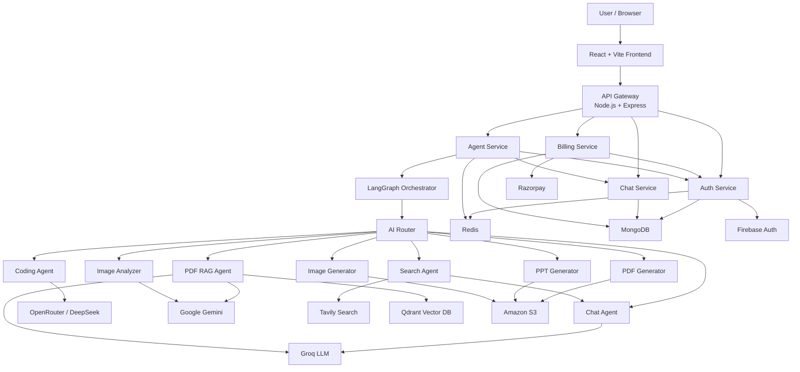

# 🤖 VisionAI

### Production-Style Multi-Agent AI Workspace with LangGraph, RAG, Web Search, Code Generation, Document Generation & Multimodal AI

VisionAI is a full-stack **multi-agent Generative AI platform** that intelligently routes user requests to specialized AI agents for general conversation, coding, real-time web search, PDF question answering, document generation, presentation generation, image generation, and image understanding.

The platform combines a **React frontend**, **Node.js/Express microservices**, **LangChain + LangGraph orchestration**, **Qdrant vector search**, **Redis memory**, **MongoDB persistence**, multiple LLM providers, Firebase authentication, Razorpay billing, and an AWS-based deployment architecture.

The system is designed as more than a chatbot: each request can be dynamically classified, routed, enriched with external context or uploaded documents, processed by a specialized agent, persisted as conversation history, and returned as text, images, downloadable files, or interactive code artifacts.

---

## ✨ Key Features

* 🧠 **LangGraph-powered multi-agent orchestration**
* 🔀 Automatic request routing based on user intent
* 💬 Conversational AI with persistent conversation history
* 🌐 Real-time web search using Tavily
* 💻 AI coding agent for generation, debugging, review and optimization
* 🖥️ Interactive Monaco-based code artifact viewer
* 👁️ Sandboxed live HTML/CSS/JavaScript preview
* 📄 PDF Retrieval-Augmented Generation using Qdrant
* 📑 AI-generated downloadable PDF documents
* 📊 AI-generated PowerPoint presentations
* 🎨 AI image generation
* 🖼️ Multimodal image analysis using Gemini
* 🎙️ Browser speech-to-text input
* 📎 PDF and image uploads up to 20 MB
* 🧠 Redis-backed conversational memory
* 💾 MongoDB conversation and application persistence
* 🔐 Google authentication with Firebase
* 🍪 Redis-backed authenticated sessions
* 💳 Razorpay subscription/credit payments
* ⚡ Per-user and per-agent rate limiting
* 💰 Credit-based AI usage system
* 📦 Dockerized backend services
* ☁️ AWS ECS + ECR backend deployment
* 🌍 S3 + CloudFront frontend hosting
* 🔄 GitHub Actions CI/CD deployment workflow

---

# 🏗️ System Architecture



---

# 🧠 Multi-Agent Architecture

VisionAI uses **LangGraph** to create a stateful AI workflow.

Every incoming prompt is passed through a router that decides which specialized agent should handle it.

Users can also manually select an agent from the frontend.

### Available modes

| Agent              | Responsibility                                      |
| ------------------ | --------------------------------------------------- |
| **Auto**           | Automatically determines the correct agent          |
| **Chat**           | General questions, explanations and conversation    |
| **Search**         | Current information and internet search             |
| **Coding**         | Code generation, debugging, review and optimization |
| **PDF**            | Generates downloadable PDF documents                |
| **PPT**            | Generates downloadable PowerPoint presentations     |
| **Vision**         | Generates images                                    |
| **PDF RAG**        | Automatically activated for uploaded PDFs           |
| **Image Analyzer** | Automatically activated for uploaded images         |

---

# 🔀 Intelligent Agent Routing

When the frontend sends:

```text
POST /api/agent/chat
```

the request reaches the Agent Service.

The request contains information such as:

```text
prompt
conversationId
agent
file
userId
```

LangGraph starts execution from the router.

```text
START
  │
  ▼
Router
  │
  ├── Chat
  ├── Search ──► Chat
  ├── Coding
  ├── PDF Generator
  ├── PPT Generator
  ├── Image Generator
  ├── PDF RAG
  └── Image Analyzer
```

### Automatic routing

When `agent=auto`, an LLM classifies the prompt.

Examples:

```text
"Explain how Kafka works"
        ↓
      Chat
```

```text
"What happened in AI news today?"
        ↓
      Search
```

```text
"Build a responsive portfolio website"
        ↓
      Coding
```

```text
"Create a PDF explaining microservices"
        ↓
       PDF
```

### File-aware routing

Uploaded files override normal intent routing.

```text
PDF Upload
   ↓
PDF RAG Agent
```

```text
Image Upload
   ↓
Image Analyzer
```

This avoids unnecessary router calls and ensures the correct multimodal pipeline is used.

---

# 💬 Chat Agent

The Chat Agent handles:

* General conversation
* Technical questions
* Educational questions
* Explanations
* Follow-up questions
* Search-result synthesis

Conversation context is loaded from Redis before each LLM request.

```text
User Prompt
     ↓
Load Conversation Memory
     ↓
Build LangChain Messages
     ↓
LLM
     ↓
Assistant Response
```

When Redis does not already contain conversation history, history can be restored from persisted messages.

This provides a combination of:

```text
MongoDB → persistent history

Redis → fast conversational context
```

---

# 🌐 Real-Time Web Search

Questions requiring current information can be routed to the Search Agent.

The system uses **Tavily Search**.

```text
User Query
     ↓
Search Agent
     ↓
Tavily
     ↓
Top Search Results + Images
     ↓
Chat Agent
     ↓
LLM Synthesis
     ↓
Final Answer
```

The search agent retrieves up to **5 results** and can also return relevant images.

Search results are then provided as context to the Chat Agent instead of returning raw search data directly.

This creates a basic tool-augmented AI workflow where:

```text
Search Agent = information retrieval

Chat Agent = reasoning + response generation
```

---

# 📄 PDF Retrieval-Augmented Generation

Uploading a PDF automatically invokes the **PDF RAG Agent**.

The complete pipeline is:

```text
PDF Upload
    ↓
Multer
    ↓
Temporary File
    ↓
pdf-parse
    ↓
Extract Text
    ↓
RecursiveCharacterTextSplitter
    ↓
Text Chunks
    ↓
Gemini Embeddings
